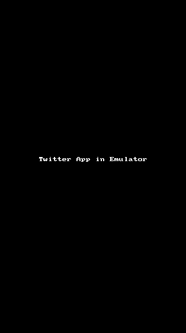

# Project 3 - *Twitter*

**Twitter** is an android app that allows a user to view his Twitter timeline and post a new tweet. The app utilizes [Twitter REST API](https://dev.twitter.com/rest/public).
This app was made for learning purposes.

Time spent: **30** hours spent in total

Elements used:
- Icons from Material.io/icons/

## User Stories

The following **required** functionality is completed:

* [x]   User can **sign in to Twitter** using OAuth login
* [x]   User can **view tweets from their home timeline**
  * [x] User is displayed the username, name, and body for each tweet
  * [x] User is displayed the [relative timestamp](https://gist.github.com/nesquena/f786232f5ef72f6e10a7) for each tweet "8m", "7h"
* [x] User can **compose and post a new tweet**
  * [x] User can click a “Compose” icon in the Action Bar on the top right
  * [x] User can then enter a new tweet and post this to twitter
  * [x] User is taken back to home timeline with **new tweet visible** in timeline
  * [x] Newly created tweet should be manually inserted into the timeline and not rely on a full refresh

The following **optional** features are implemented:

* [x] User can **see a counter with total number of characters left for tweet** on compose tweet page
* [x] User can **pull down to refresh tweets timeline**
* [x] User is using **"Twitter branded" colors and styles**
  * [x] Used the quite recent twitter theme *Night Mode*, which is why my app is dark blue.
* [x] User sees an **indeterminate progress indicator** when any background or network task is happening
* [x] User can **select "reply" from detail view to respond to a tweet**
  * [x] User that wrote the original tweet is **automatically "@" replied in compose**
* [x] User can tap a tweet to **open a detailed tweet view**
  * [x] User can **take favorite (and unfavorite) or reweet** actions on a tweet
    * [x] User can retweet/unretweet in detailed tweet mode.
* [x] User can **see embedded image media within a tweet** on list or detail view.

The following **bonus** features are implemented:

* [x] User can view more tweets as they scroll with infinite pagination
* [ ] Compose tweet functionality is build using modal overlay
* [x] Use Parcelable instead of Serializable using the popular [Parceler library](http://guides.codepath.com/android/Using-Parceler).
* [x] Replace all icon drawables and other static image assets with [vector drawables](http://guides.codepath.com/android/Drawables#vector-drawables) where appropriate.
* [x] User can **click a link within a tweet body** on tweet details view. The click will launch the web browser with relevant page opened.
* [ ] User can view following / followers list through any profile they view.
* [x] User can see embedded image media within the tweet detail view
* [ ] Use the popular ButterKnife annotation library to reduce view boilerplate.
* [ ] On the Twitter timeline, leverage the [CoordinatorLayout](http://guides.codepath.com/android/Handling-Scrolls-with-CoordinatorLayout#responding-to-scroll-events) to apply scrolling behavior that [hides / shows the toolbar](http://guides.codepath.com/android/Using-the-App-ToolBar#reacting-to-scroll).
* [ ] User can **open the twitter app offline and see last loaded tweets**. Persisted in SQLite tweets are refreshed on every application launch. While "live data" is displayed when app can get it from Twitter API, it is also saved for use in offline mode.

The following **additional** features are implemented:

* [ ] List anything else that you can get done to improve the app functionality!
  * [x] Set up to retrieve tweet counts and like counts
  * [x] Display activity text instead of AppName ("TWITTER"). e.g.: Home, New Tweet / In Reply To , Tweet (for detailed tweet)
  * [x] Improve the quality of the images received
  * [x] Remove Toast Statements on onClick events from TweetAdapter
  * [x] On reply, set handler to tweet id (in reply to, check twitter API) so that replies work in actual replies
  * [x] For images of tweets, have a different placeholder than the one of profile photos (similar to Flixster app placeholder)
  * [ ] Make infinite pagination on user profile's tweets
  * [ ] Make the follow button actually work
  * [ ] Add tabs to user profile
  * [ ] User can see a user's profile by clicking on the profile picture of the user.
  * [ ] Fix bugs resulting from infinite scroll and repeating the same tweets over and over when web error occurs
  * [ ] Add a backpress button when user enters reply to a tweet (instead of letting be for the regular android backPress)
  * [ ] When click on backPress in the timeline, it just restart the application instead of quitting it. Fixing this bug would be a goal
  * [ ] Make the follow button work on user profiles
  * [ ] On the profile view, display an action bar as the user scrolls down (with a back button)
  * [ ] Add search tab with various search functions implemented (mentions, tags, users, etc)

## Video Walkthrough

Here's a walkthrough of implemented user stories:

GIF created with [LiceCap](http://www.cockos.com/licecap/).

## Notes

Describe any challenges encountered while building the app.

I was done with the requirements early-ish (although a bit later than most of my table). It was quite challenging to figure out how to take control of the UI in this app (spread things equally, load better quality images, add line separators for each tweet, etc). However, I was able to get it done up to how I wanted it to be, so I am happy about that. In addition, whenever I tried to implement something that I haven't implemented, it was difficult to figure out how to do it and having to search through at least 6 StackOverflow and Android Documentations pages altogether for each implementation. However, I feel like I got better at that. Finally, I really enjoyed taking more advantage of the android studio app: e.g.: using the debugger to find where the code breaks, using the monitor to check the log statements with TAGs, and using shortcuts to increase my efficiency/delivery.

I really enjoyed building this app. I learned a lot and am more confident about my skill in android development.

## Open-source libraries used

- [Android Async HTTP](https://github.com/loopj/android-async-http) - Simple asynchronous HTTP requests with JSON parsing
- [Glide](https://github.com/bumptech/glide) - Image loading and caching library for Android

## License

    Copyright [2017] [Robert M. Vunabandi]

    Licensed under the Apache License, Version 2.0 (the "License");
    you may not use this file except in compliance with the License.
    You may obtain a copy of the License at

        http://www.apache.org/licenses/LICENSE-2.0

    Unless required by applicable law or agreed to in writing, software
    distributed under the License is distributed on an "AS IS" BASIS,
    WITHOUT WARRANTIES OR CONDITIONS OF ANY KIND, either express or implied.
    See the License for the specific language governing permissions and
    limitations under the License.

